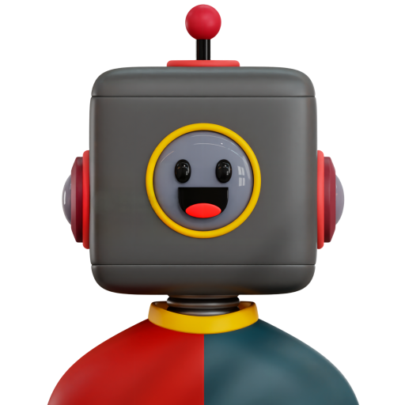

<div align="center">

# 🤖 rootChat

**A private, offline-first local AI desktop assistant for Linux.**  
Built natively with Python & PySide6, powered exclusively by [Ollama](https://ollama.ai).

[](https://opensource.org/licenses/MIT)
[](https://www.python.org/)
[](https://ubuntu.com)
[](https://github.com/Ahmad10Raza/rootChat/releases)
[](https://github.com/Ahmad10Raza/rootChat)

<br/>



<br/>

</div>

---

## 📖 Overview

**rootChat** brings the power and polish of modern conversational AI assistants directly to your Linux desktop while guaranteeing **complete privacy**. 

Unlike web-based AI tools or cloud wrapper apps:
- **Zero Cloud Dependencies**: Connects strictly to your local Ollama instance (`http://localhost:11434`).
- **Zero Telemetry & Tracking**: No analytics, no accounts, and no data leaves your machine.
- **True Desktop Integration**: Built as a native Linux application with system tray support, spotlight mini-chat, FreeDesktop icon standards, and Ubuntu GNOME dock integration.

---

## ✨ Features

- 🔒 **100% Local & Private**: All model inference, conversations, and document embeddings stay on your hardware.
- ⚡ **Spotlight-Style Mini-Chat**: Hit <kbd>Ctrl</kbd>+<kbd>Space</kbd> anywhere to summon a floating HUD for quick queries without switching your workspace.
- 📦 **In-App Model Manager**: Browse, download (with real-time progress & transfer speed), inspect, and delete local Ollama models directly from the UI (<kbd>Ctrl</kbd>+<kbd>M</kbd>).
- 🎭 **Specialized Prompt Presets**: Switch between built-in personas tailored for coding, Linux administration, SQL, technical writing, executive summaries, or custom instructions.
- 🧠 **Persistent Local Memory**: Remembers key user preferences and personal facts ("I prefer Python and concise explanations") with dedicated top-bar and sidebar toggle switches.
- 📚 **Document Knowledge Base (RAG)**: Ingest PDFs, code files, DOCX, and plain text notes with local semantic retrieval, citation chips, and per-conversation scoping.
- ⚙️ **Comprehensive Settings & Storage**: Customize default model, default persona, generation temperature slider, context history limits, and run SQLite `VACUUM` database maintenance.
- 🎨 **Modern Dark & Light Themes**: Refined dark canvas (`#0F1117`) and crisp light canvas (`#F6F8FA`) with vibrant Safety Orange accents (`#FF5F15`), smooth card-based scrollable settings, and balanced typography.
- 🖼️ **Custom In-Chat Avatars**: Transparent 3D robot branding for the assistant and a clean user avatar badge for prompt messages.
- 📌 **Conversation Management**: Pin important chats to top, archive past chats with an inline toggle badge, rename, search, and export conversations to Markdown, Plain Text, or JSON.
- 🔔 **Linux System Tray**: Minimizes cleanly to tray on close, displays generation progress, and delivers native desktop notifications upon response completion.

---

## 🚀 Installation

rootChat is packaged as a standard modern Linux application in `.deb`, portable `.AppImage`, and `.flatpak` formats.

### Option 1: Debian Package (`.deb`) — Recommended for Ubuntu / Debian

The `.deb` package installs rootChat into standard Linux directories (`/opt/rootChat`, `/usr/bin/rootChat`, `/usr/share/applications`, and `/usr/share/icons`), integrating with your application launcher and GNOME Dock.

1. Download `rootChat_0.7.1_amd64.deb` from the [Latest Release](https://github.com/Ahmad10Raza/rootChat/releases/latest).
2. Install via terminal:
   ```bash
   sudo apt install ./rootChat_0.7.1_amd64.deb
   ```
3. Launch from your application menu or run:
   ```bash
   rootChat
   ```

To uninstall:
```bash
sudo apt remove rootchat
```

---

### Option 2: Portable AppImage (`.AppImage`) — Universal Linux

Runs on any modern Linux distribution without installation:

1. Download `rootChat-0.7.1-x86_64.AppImage` from the [Latest Release](https://github.com/Ahmad10Raza/rootChat/releases/latest).
2. Make it executable:
   ```bash
   chmod +x rootChat-0.7.1-x86_64.AppImage
   ```
3. Run:
   ```bash
   ./rootChat-0.7.1-x86_64.AppImage
   ```

---

### Option 3: Flatpak / Flathub

rootChat is prepared for publication on Flathub as `io.github.Ahmad10Raza.rootChat`:
- **Manifest**: [`packaging/flatpak/io.github.Ahmad10Raza.rootChat.yaml`](packaging/flatpak/io.github.Ahmad10Raza.rootChat.yaml)
- **Publishing & Submission Guide**: [`docs/FLATHUB_PUBLISHING_GUIDE.md`](docs/FLATHUB_PUBLISHING_GUIDE.md)

---

### Option 4: Run from Source (Development)

1. **Clone the repository:**
   ```bash
   git clone https://github.com/Ahmad10Raza/rootChat.git
   cd rootChat
   ```

2. **Create and activate a virtual environment:**
   ```bash
   python3 -m venv .venv
   source .venv/bin/activate
   ```

3. **Install dependencies:**
   ```bash
   pip install -r requirements.txt
   ```

4. **Launch the application:**
   ```bash
   python app.py
   ```

---

## 📋 System Requirements

- **Operating System**: Ubuntu 22.04 / 24.04 LTS or compatible Linux distribution
- **Architecture**: x86_64 / amd64
- **Local LLM Engine**: [Ollama](https://ollama.com) installed and running:
  ```bash
  # Install Ollama (if not already installed)
  curl -fsSL https://ollama.com/install.sh | sh

  # Pull your preferred model
  ollama pull llama3.2
  ```

---

## ⌨️ Keyboard Shortcuts

| Shortcut | Description |
|---|---|
| <kbd>Ctrl</kbd> + <kbd>Space</kbd> | Toggle Floating Mini-Chat HUD |
| <kbd>Ctrl</kbd> + <kbd>N</kbd> | Start a new chat |
| <kbd>Ctrl</kbd> + <kbd>B</kbd> | Toggle sidebar collapse / expand |
| <kbd>Ctrl</kbd> + <kbd>K</kbd> | Focus conversation search bar |
| <kbd>Ctrl</kbd> + <kbd>M</kbd> | Open Ollama model manager |
| <kbd>Ctrl</kbd> + <kbd>,</kbd> | Open application settings |
| <kbd>Ctrl</kbd> + <kbd>/</kbd> or <kbd>?</kbd> | Open keyboard shortcuts help modal |
| <kbd>Escape</kbd> | Stop active generation / Close modals |
| <kbd>Enter</kbd> | Send message (configurable in Settings) |
| <kbd>Shift</kbd> + <kbd>Enter</kbd> | Insert newline in message input |

---

## 🏗️ Architecture

```
┌──────────────────────────────────────────────────────────────┐
│                    rootChat Linux Desktop                    │
│                                                              │
│  ┌───────────────────────┐       ┌────────────────────────┐  │
│  │   Sidebar Navigation  │       │      Chat Viewport     │  │
│  │  ───────────────────  │       │  ────────────────────  │  │
│  │  • New Chat & Search  │       │  • User/Bot Avatars    │  │
│  │  • Pinned Chats       │       │  • Markdown & Code     │  │
│  │  • Date-Grouped Hist  │       │  • Speed Token Monitor │  │
│  │  • Archive View [ON]  │       │  • Regenerate & Copy   │  │
│  │  • Persona Presets    │       │  • Multi-line Composer │  │
│  └───────────────────────┘       └────────────────────────┘  │
│                                                              │
│  ┌────────────────────────────────────────────────────────┐  │
│  │   Modals: Mini-Chat HUD | Model Manager | Settings     │  │
│  └────────────────────────────────────────────────────────┘  │
└──────────────────────────────┬───────────────────────────────┘
                               │
                               ▼
┌──────────────────────────────────────────────────────────────┐
│                      Application Core                        │
│                                                              │
│  • ChatManager       • MemoryManager      • DocumentManager  │
│  • AppState / Config • ExportManager      • Presets          │
└──────────────┬───────────────────────────────┬───────────────┘
               │                               │
               ▼                               ▼
    ┌────────────────────┐          ┌────────────────────┐
    │   Local Storage    │          │  Ollama Local API  │
    │                    │          │  (localhost:11434) │
    │ • SQLite DB        │          │                    │
    │ • Vector Store     │          │ • Stream Chat      │
    │ • Config JSON      │          │ • Model Pull/List  │
    └────────────────────┘          └────────────────────┘
```

---

## 🛠️ Building Packages

To build both the `.deb` installer and the standalone `.AppImage`:

```bash
bash packaging/scripts/build_linux.sh
```

The output packages and SHA256 checksums will be generated in `dist/`:
- `dist/rootChat_0.7.0_amd64.deb`
- `dist/rootChat-0.7.0-x86_64.AppImage`
- `dist/SHA256SUMS`

---

## 🧪 Testing

rootChat includes an isolated test suite:

```bash
.venv/bin/python -m unittest discover -s tests
```

Tests run in isolated temporary environments and will never modify or overwrite your personal `~/.config/rootChat/config.json` configuration.

---

## 🤝 Contributing

Contributions, bug reports, and feature requests are welcome!  
Please see [CONTRIBUTING.md](CONTRIBUTING.md) for guidelines on code style, testing, and pull requests.

---

## 📄 License

This project is licensed under the [MIT License](LICENSE) — Copyright (c) 2026 Ahmad Raza.
